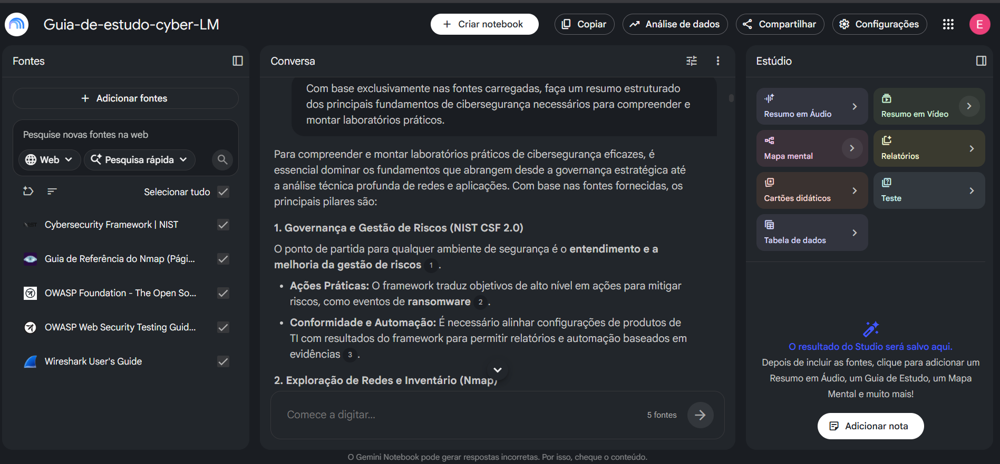

# 🛡️ Fundamentos de Cibersegurança para Laboratórios Práticos com NotebookLM

> Projeto desenvolvido como parte do desafio **"Treinando uma IA de Aprendizagem: Explore o Poder do NotebookLM"** da DIO (Digital Innovation One).

## 📖 Sobre o Projeto

Este projeto tem como objetivo explorar o uso do **NotebookLM** como ferramenta de aprendizagem ativa na área de **Cibersegurança**. Em vez de utilizar a Inteligência Artificial apenas para gerar respostas prontas, a proposta foi construir um processo estruturado de estudo, utilizando fontes oficiais, engenharia de prompts e documentação do aprendizado.

O tema escolhido foi **Fundamentos de Cibersegurança para Laboratórios Práticos**, por ser uma área de grande relevância para profissionais de Tecnologia da Informação e por fornecer uma base sólida para estudos futuros em segurança ofensiva, segurança defensiva e infraestrutura.

---

  

## 📑 Índice

- Sobre o Projeto
- Objetivos
- Curadoria das Fontes
- Estratégia de Aprendizagem
- Engenharia de Prompts
- Cicatrizes (Troubleshooting)
- Miniguia de Estudos
- Glossário
- Prompts Reutilizáveis
- Lições Aprendidas
- Considerações Finais
- Autor

# 🎯 Objetivos

## Objetivo Geral

Construir um caderno temático utilizando o NotebookLM para organizar, compreender e revisar conceitos fundamentais de cibersegurança aplicados à criação de laboratórios práticos.

## Objetivos Específicos

- compreender os princípios fundamentais da segurança da informação;
- identificar ameaças, vulnerabilidades e mecanismos de proteção;
- aprender a utilizar fontes técnicas oficiais como base de estudo;
- experimentar diferentes estratégias de prompts no NotebookLM;
- documentar os resultados obtidos durante o processo de aprendizagem;
- produzir um miniguia reutilizável para estudos futuros.

---

# 📚 Curadoria das Fontes

Foram selecionadas cinco fontes oficiais e amplamente reconhecidas na área de Segurança da Informação.

| Fonte | Objetivo | Justificativa | Contribuição para NotebookLM |
|--------|----------|---------------|------------------------------|
| OWASP Top 10 | Estudar as principais vulnerabilidades em aplicações web | Principal referência mundial sobre riscos de segurança em aplicações | Permitiu comparar riscos comuns em aplicações web. |
| OWASP Web Security Testing Guide (WSTG) | Compreender metodologias de testes de segurança | Complementa o Top 10 com procedimentos práticos | Forneceu metodologia prática para validação de segurança. |
| NIST Cybersecurity Framework (CSF 2.0) | Estudar boas práticas e governança em segurança | Framework utilizado internacionalmente | Relacionou conceitos técnicos com gestão de segurança. |
| Documentação Oficial do Nmap | Aprender reconhecimento de redes | Referência oficial da ferramenta | Serviu de base para estudos sobre mapeamento de redes. |
| Wireshark User's Guide | Estudar captura e análise de pacotes | Manual oficial para análise de tráfego | Auxiliou na compreensão da análise de pacotes. |
---

# 🧠 Estratégia de Aprendizagem

O NotebookLM foi utilizado como um ambiente de estudo, permitindo:

- sintetizar conteúdos;
- comparar conceitos entre diferentes fontes;
- identificar lacunas de conhecimento;
- construir glossários;
- criar perguntas de revisão;
- validar respostas com base exclusivamente nas fontes carregadas.

O objetivo não foi substituir o estudo tradicional, mas potencializá-lo por meio da Inteligência Artificial.

---

# 🤖 Engenharia de Prompts

Durante o desenvolvimento do projeto foram realizados diversos testes para compreender como pequenas alterações na formulação dos prompts influenciam a qualidade das respostas.

## Exemplo 1

### Prompt Inicial

> Explique o que é um firewall.

### Resultado

Resposta correta, porém bastante genérica.

### Problema

Pouco contexto e ausência de comparação com outras tecnologias.

### Prompt Refinado

> Com base exclusivamente nas fontes carregadas, compare Firewall, IDS e IPS, destacando diferenças, vantagens, limitações e exemplos de utilização em laboratórios de cibersegurança.

### Aprendizado

Adicionar contexto e restringir as fontes gera respostas mais completas e alinhadas ao material estudado.

---

## Exemplo 2

### Prompt Inicial

> Faça um resumo do NIST.

### Problema

Resumo muito superficial.

### Prompt Refinado

> Explique cada uma das funções do NIST Cybersecurity Framework 2.0 e relacione-as com exemplos práticos de um laboratório de segurança.

### Aprendizado

Solicitar aplicações práticas aumenta significativamente a qualidade do conteúdo.

---

# ⚠️ Cicatrizes (Troubleshooting)

Durante o desenvolvimento do projeto foram observadas algumas dificuldades.

| Situação | Solução |
|----------|----------|
| Prompts muito genéricos produziram respostas superficiais | Inserção de contexto e objetivo específico |
| Perguntas amplas misturavam conceitos de diferentes documentos | Solicitação para utilizar apenas as fontes carregadas |
| Algumas respostas omitiram detalhes importantes | Divisão da pergunta em partes menores |

Essas dificuldades demonstraram a importância da engenharia de prompts como parte do processo de aprendizagem.

---

# 📒 Miniguia de Estudos

## Conceitos Fundamentais

- Confidencialidade
- Integridade
- Disponibilidade
- Autenticação
- Autorização
- Não Repúdio

## Principais Ameaças

- Malware
- Phishing
- Engenharia Social
- Ransomware
- Ataques de força bruta

## Ferramentas Estudadas

- Nmap
- Wireshark

## Frameworks

- OWASP Top 10
- OWASP WSTG
- NIST CSF 2.0

---

# 📖 Glossário

**CIA Triad** — Modelo composto por Confidencialidade, Integridade e Disponibilidade.

**Firewall** — Dispositivo ou software responsável por controlar o tráfego entre redes.

**IDS** — Sistema de Detecção de Intrusão.

**IPS** — Sistema de Prevenção de Intrusão.

**Hardening** — Processo de fortalecimento da segurança de um sistema.

**Superfície de Ataque** — Conjunto de pontos que podem ser explorados por um atacante.

**CVE** — Identificador público de vulnerabilidades conhecidas.

**CVSS** — Sistema utilizado para classificar a gravidade de vulnerabilidades.

---

# 💬 Prompts Reutilizáveis

- Explique este conceito utilizando apenas as fontes carregadas.
- Compare os conceitos apresentados por diferentes documentos.
- Quais informações aparecem em todas as fontes?
- Quais divergências existem entre os documentos?
- Crie dez perguntas de revisão baseadas exclusivamente nas fontes.
- Monte um mapa mental sobre este assunto.
- Gere um glossário contendo os principais termos técnicos.
- Quais conhecimentos prévios são necessários para compreender este tema?

---

# 💡 Lições Aprendidas

Ao longo deste projeto foi possível perceber que a qualidade das respostas geradas pela IA depende diretamente da qualidade das perguntas realizadas.

Também ficou evidente que:

- boas fontes produzem melhores respostas;
- prompts específicos geram respostas mais úteis;
- documentar erros faz parte do processo de aprendizagem;
- o NotebookLM funciona melhor quando utilizado como ferramenta de apoio ao estudo, e não como substituto do raciocínio crítico.

---

# 🚀 Conclusão

O desenvolvimento deste projeto demonstrou que a Inteligência Artificial pode atuar como uma importante ferramenta de aprendizagem ativa quando utilizada de forma consciente e estruturada.

A combinação entre curadoria de fontes confiáveis, engenharia de prompts e documentação do processo permitiu construir um material reutilizável para estudos futuros e reforçou a importância da validação crítica das respostas geradas pela IA.

---

# 🚀 Próximos Passos

- Expandir o caderno com novos frameworks de segurança.
- Adicionar estudos sobre SIEM e SOC.
- Comparar respostas do NotebookLM com outros modelos de IA.
- Atualizar o conteúdo conforme novas versões das fontes oficiais.

# 👨‍💻 Autor

<table>
  <tr>
    <td align="center">
      <a href="https://github.com/edudsprado" title="Perfil Eduardo">
         
        
          <b>Eduardo Prado</b>
        
      </a>
    </td>
  </tr>
</table>

Projeto desenvolvido para o desafio da **Digital Innovation One (DIO)** com foco na utilização do NotebookLM como ferramenta de aprendizagem ativa em Cibersegurança.
